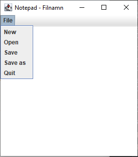
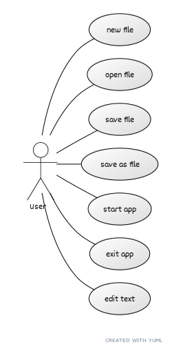
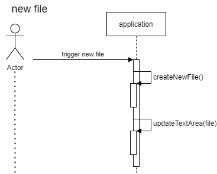
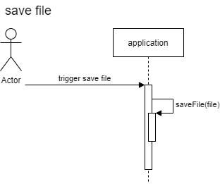
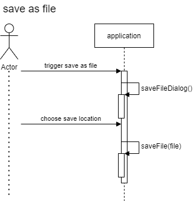
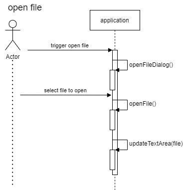
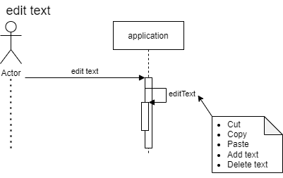
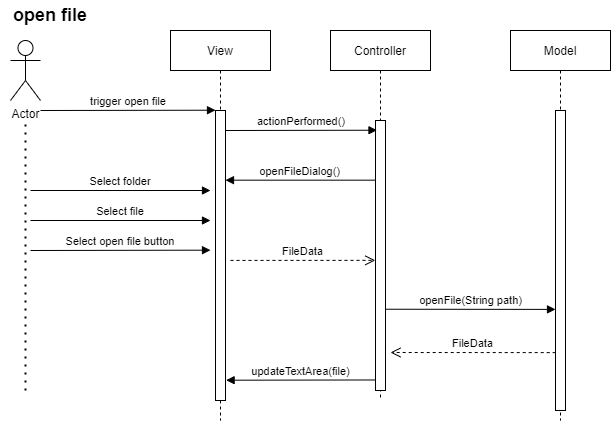
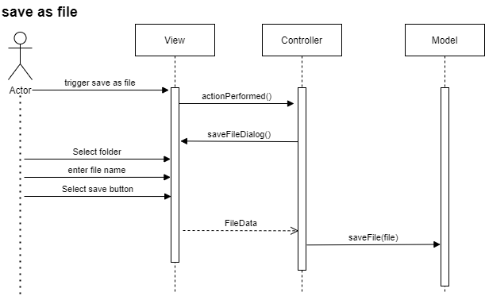
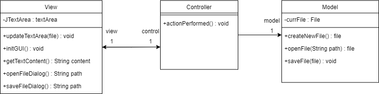

# **Laboration 1**

**Av: Johan Cederhag**

**Kravspecifikation och beskrivning av projekt**

Min design ska beskriva och konceptualisera en enkel textredigerare, likt 'notepad'. Användaren kan skriva och redigera text i programmet för att sedan spara texten till fil. Användaren kan välja att öppna en redan befintlig fil eller skapa en ny tom fil.

**Exempel på layout:**

Filhantering ska göra det möjligt att lagra data så att den kvarstår. Användaren ska kunna göra följande operationer:

* Skapa ny fil
* Öppna befintlig fil
* Spara den nuvarande öppna filen 
* Spara den nuvarande fil genom att välja vart den ska sparas
* Redigera text, denna innehåller mindre operationer såsom:
  * Kopiera text, Klipp ut text, Klistra in text
* Operationerna ovan ska vara tillgängliga i menyn, via knappen "File"

# Design krav

* Utvecklas i språket Java (eclipse utvecklingsmiljö)
* Swing java bibliotek för GUI
* Arkitekturen ska följa designmönstret MVC
* Minimal kommunikation mellan MVC klasserna
* Filhantering

# Resultat från Analys

### Use case diagram (Analys)

## Sekvensdiagram (Analys)

### new file sekvens (Analys)

### save file sekvens (Analys)

### save as file sekvens (Analys)

### open file sekvens (Analys)

### edit text sekvens (Analys)

## Klassdiagram (Analys)

.drawio.png)

# Resultat från Design

## Sekvensdiagram (Design)
### new file sekvens (alt 0) (Design)

.drawio.png)

### new file sekvens (alt 1) (Design)

.drawio.png)

### open file sekvens (Design)

### save as File sekvens (Design)

### save file sekvens (alt 0) (Design)

.drawio.png)

### save file sekvens (alt 1) (Design)

.drawio.png)

## Klassdiagram (design)

### Application  Analys + Design 

drawio.png)

### Application diagram Design MVC

#### **Version 1:**

#### **Version 2:**

.drawio.png)

