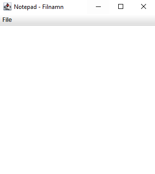
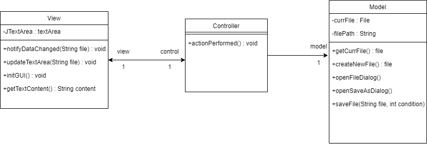

## **Laboration 1**

**Av: Johan Cederhag**

**Kravspecifikation och beskrivning av projekt**

Min design ska beskriva och konceptualisera en enkel textredigerare, likt 'notepad'. Användaren kan skriva och redigera text i programmet för att sedan spara texten till fil. Användaren kan välja att öppna en redan befintlig fil eller skapa en ny tom fil.

**Exempel på layout:**

Filhantering ska göra det möjligt att lagra data så att den kvarstår. Användaren ska kunna göra följande operationer:

* Öppna en ny tom fil
* Öppna befintlig fil
* Spara den nuvarande öppna filen (har dokumentet en redan befintlig fil kommer användaren bara behöva trycka på 'save', har dokumentet inte det kommer användaren behöva välja vart filen ska sparas)
* Spara den nuvarande fil genom att välja vart den ska sparas (spar-dialog öppnas)
* Redigera text, denna innehåller mindre operationer såsom:
  * Kopiera text, Klipp ut text, Klistra in text

## Design krav

* Utvecklas i Java (eclipse)
* Swing java bibliotek för GUI
* Arkitekturen ska följa designmönstret MVC
* Filhantering
* Minimal kommunikation mellan MVC klasserna

**ATT GÖRA**

* "edit text" - use case

  * Addera en sekvens diagram med en note där cut,copy,paste finns med - Sekvens diagrammet ska heta EDIT TEXT

* Användaren ska bara interagera med VIEW

  * openFileDialog() - anropas från controller i view
  * saveFileDialog() - anropas från controller i view
  * Dessa **funktioner** ska finnas i **VIEW**
  * Controller tar sedan emot returen och skickar till model - "Öppna denna fil"
  * user input -> View [användaren vill öppna fil] -> controller [View.VisaÖppnaFilDialog] -> View [användaren valde denna fil] -> Controller [Läs in denna fil] -> Model ... Retur fil osv, **slutligen** View visa denna fil på skärmen.. SLUT

  **KLART**

  * Save as diagram
  * open file diagram

## Resultat från Analys

### Use case diagram

### new file sekvens (Analys)

### open file sekvens(Analys)

### save as File sekvens (Analys)

### save file sekvens (Original alt) (Analys)

.drawio.png)

### save file sekvens(Alt 1)

.drawio.png)

## Resultat från Design

### Klassdiagram (design)

5
