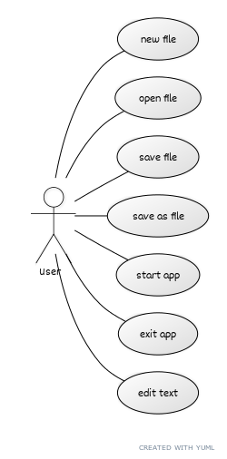

## **Laboration 1**

**Av: Johan Cederhag**

**Kravspecifikation och beskrivning av projekt**

* Programmets beskrivning i text

* Lista med funktionalitet (USE CASES)
* Ladda och spara beskriva

## Design krav

* Språk
* Swing java bibliotek för GUI
* Arkitekturen ska följa designmönstret MVC
* Filhantering
* Minimal kommunikation mellan MVC klasserna

## Resultat från Analys

### Use case diagram

Lorem ipsum bla bla hey Och Hå!

## Resultat från Design

### Klassdiagram (design)

