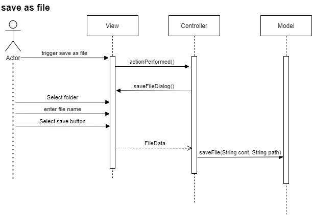

## **Laboration 1**

**Av: Johan Cederhag**

**Kravspecifikation och beskrivning av projekt**

Programmets beskrivning i text

Min design ska beskriva och konceptualisera en enkel textredigerare, likt 'notepad'. Användaren kan skriva och redigera text i programmet för att sedan spara texten till fil. Användaren kan välja att öppna en redan befintlig fil eller skapa en ny tom fil.

**Exempel på layout:**

Filhantering ska göra det möjligt att lagra data så att den kvarstår. Användaren ska kunna göra följande operationer:

* Öppna en ny tom fil
* Öppna befintlig fil
* Spara den nuvarande öppna filen (har dokumentet en redan befintlig fil kommer användaren bara behöva trycka på 'save', har dokumentet inte det kommer användaren behöva välja vart filen ska sparas)
* Spara den nuvarande fil genom att välja vart den ska sparas (spar-dialog öppnas)
* Redigera text, denna innehåller mindre operationer såsom:
  * Kopiera text, Klipp ut text, Klistra in text

## Design krav

* Utvecklas i Java (eclipse)
* Swing java bibliotek för GUI
* Arkitekturen ska följa designmönstret MVC
* Filhantering
* Minimal kommunikation mellan MVC klasserna

## Resultat från Analys

### Use case diagram

### new file (Analys)

### open file (Analys)

### save as File (Analys)'

### save file(Original alt) (Analys)

.drawio.png)

### save file (Alt 1)

.drawio.png)

## Resultat från Design

### Klassdiagram (design)

