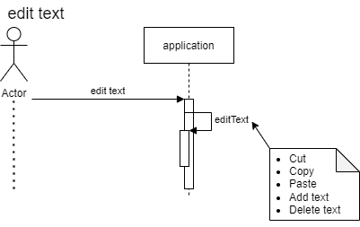

# **Laboration 2**

### Use case diagram (Analys)

## Sekvensdiagram (Analys)

### new file sekvens (Analys)

### save file sekvens (Analys)

### save as file sekvens (Analys)

### open file sekvens (Analys)

### edit text sekvens (Analys)

## Klassdiagram (Analys)

.drawio.png)

# Resultat från Design

## Sekvensdiagram (Design)
### new file sekvens (alt 0) (Design)

.drawio.png)

### new file sekvens (alt 1) (Design)

.drawio.png)

### open file sekvens (Design)

### save as File sekvens (Design)

### save file sekvens (alt 0) (Design)

.drawio.png)

### save file sekvens (alt 1) (Design)

.drawio.png)

## Klassdiagram (design)

### Application  Analys + Design 

drawio.png)

### Application diagram Design MVC

#### **Version 1 (From labb 1):**

#### **Version 2 (Updated in line with the result from labb2):**

.drawio.png)

